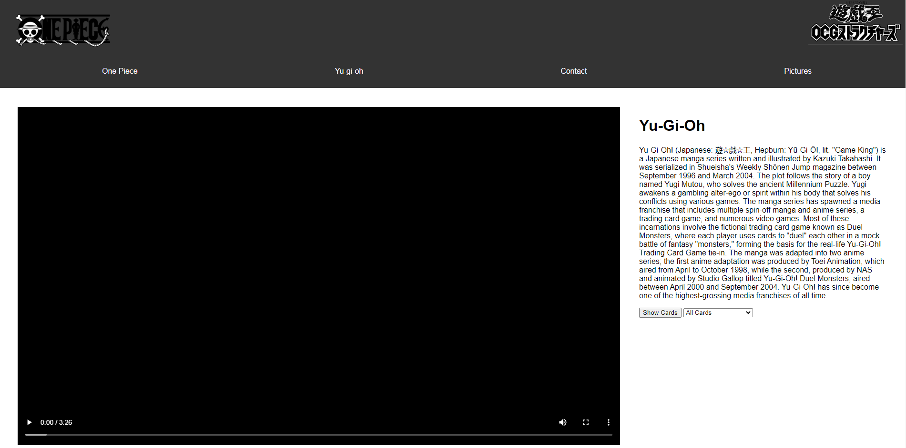
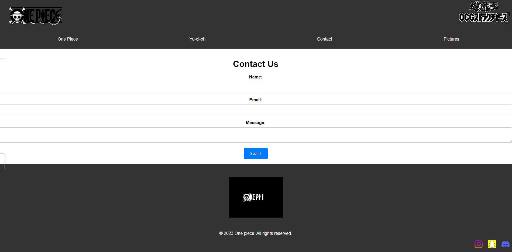
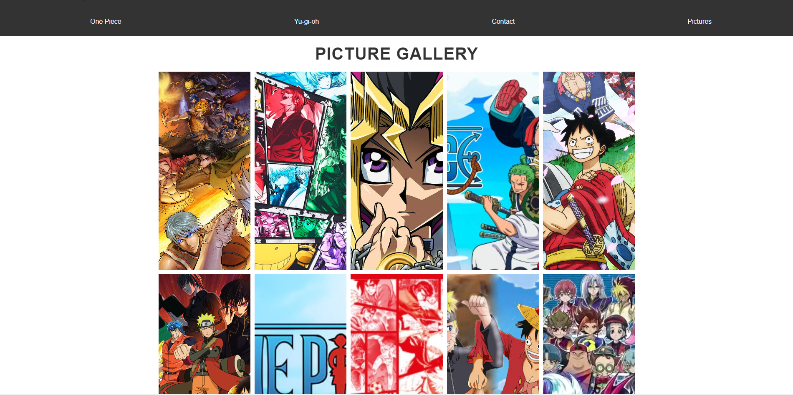

###  ONE PIECE X YU-GI-OH ###

### Instruction 
* copy the repo's link.
* clone the repo to a specific folder.
* open visual code.
* use the command prompt to direct to the right folder and directory.
* make sure to have node.js installed in the computer you are using.
* in the command prompt type npm install to install the svelte components so as to be able to run the code.
* Once done with installing the components type npm run dev.
* click on the link provided after the npm run dev command.
* The website is running in your default browser.

### Topic

I choose anime as my site topic because my really long time admiration and Anime boasts such vibrancy and diversity in its characters. People in anime have dynamic personalities, they’re whole people (even when they aren’t human); they have dreams and goals, and beyond that, there’s just so much variance in what they are. Ghosts, detectives, ghouls, pirates, demons, high school students, office workers… the list goes on, and there’s no limit to what a character might be, or who they might be.

### Inspiration site.
* https://chromaticdreamers.com/animes-to-motivate-you/  This particular website has inspired me to build a website with the page showing a video and paragraph in it. Although it has youtube video as one of it major thing I decided to have the video installed in my static video folder so I can just play the video with control code in the website rather than having a youtube video link in the site and ending up the user in a different page which I find quite annoying.
* https://www.waca.associates/en/contact-us/ Making the contact was something I wanted to leave to the last as it was whole java script and during the course we were learning java script at week 9 and 10 but once I learned it during the course and practiced during the mid semester break I tried to learn more from online resources and when I was surfing this particular website while in my own bed after work at night I clicked on the contacts page and it amazed me that how simple and yet attractive it is. This site gave me an inspiration to start right away and work on building my own website's contact page and I ended up replicating not perfectly but still almost same.
* https://www.jstor.org/stable/20787689 This particular websites hovering effect on the nav bar looked amazing and had a great appeal to me , and I found amusing to find the exact same hovering effects for it in my own website.
### A small trip to the website 

  
This is the main page where the contents for the anime one piece is displayed here the nav bar and the short video of the website in displayed with a short description of the anime from the wikipedia is taken. The footer is made of gifs with the social media links to instagram, snapchat and discord.

   
'
The is my second page where the anime yu gi oh is displayed with a short video of the anime with music and a short description of the anime. 

 This here is from the second page yu gi oh it is a button when clicked upon it displays the yu gi oh cards.

 once clicked on show cards it starts displaying the cards in a grid with hovering effects.
 once clicked on show cards the cards will display under the video and paragraph and the button switch's to hide cards as on clicking hide cards the cards are hidden again the website page is turned back to default.

